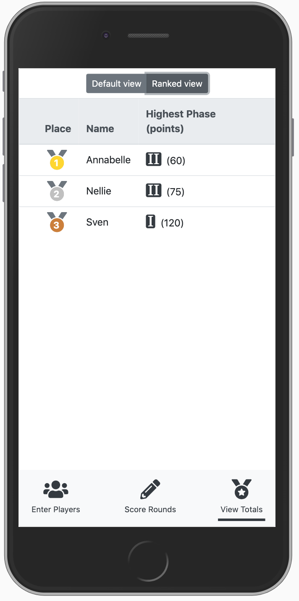

# Phase 10 Scorekeeper

This is a simple, static app that allows the user to keep score for a Phase 10 game. Begin by entering the names of the players. More players can be added later, but they will not be added to previous rounds if the game has already begun.

Keep score by entering the pointed earned each round on the 'Score Rounds' tab, and selecting whether or not each player got their current phase.

Check to see who's winning by clicking the 'View Totals' tab and clicking 'Ranked View'. Players are sorted by highest phase achieved, then by least total points.

Please note that the app does *not* save scores; all data will be lost upon reload.

## Screenshots

